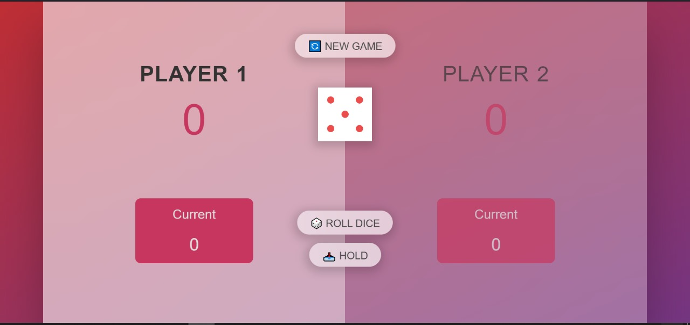

# Pig Game

Pig Game is a simple dice game built using HTML, CSS, and JavaScript. In this game, two players take turns rolling a dice. Each player accumulates points based on the dice rolls, with the goal of reaching a predefined score to win the game.

## How to Play

1. **Setup**: Each player starts with a score of 0.
2. **Gameplay**: 
    - Players take turns rolling a dice by clicking the "Roll dice" button.
    - If a player rolls a 1, they lose their current score and it becomes the next player's turn.
    - If a player rolls any other number, that number is added to their current score.
    - Players can choose to "Hold" their current score, which adds it to their total score and ends their turn.
3. **Winning**: The first player to reach a predefined score (usually 100) wins the game.
4. **New Game**: Click the "New game" button to start a new game.

## Features

- **Dynamic UI**: The game features a dynamic user interface that updates to show the current player, their scores, and the result of each dice roll.
- **Audio Effects**: Winning the game triggers an audio effect to enhance the gaming experience.
- **Responsive Design**: The game interface is designed to work well on different screen sizes, making it playable on both desktop and mobile devices.

## Installation

1. Clone the repository to your local machine:

    ```bash
    git clone git@github.com:Mohda24/Pig-Game.git
    ```

2. Open the `index.html` file in your web browser to start playing the game.

## Screenshots




## Credits

- **Dice Images**: Dice images used in the game are from [FontAwesome](https://fontawesome.com/icons/dice).

## Author

[Mhamed Ouzed](https://github.com/Mohda24)
